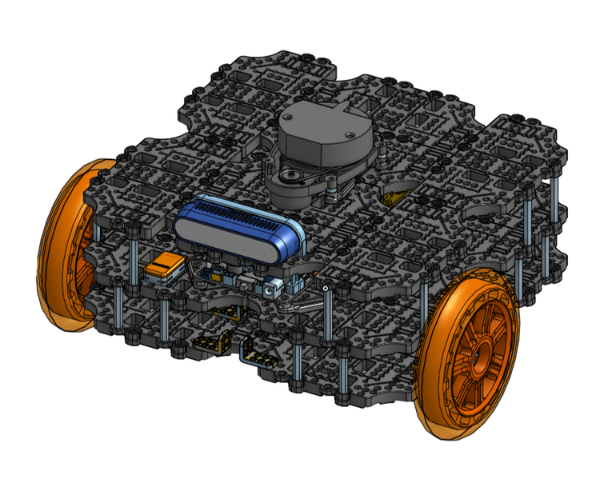
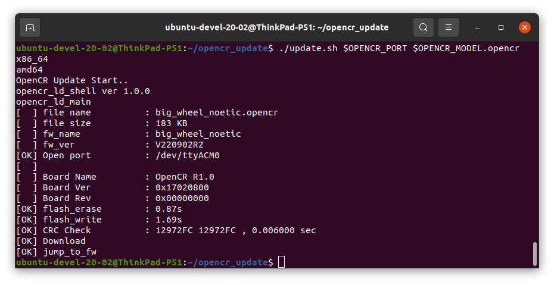
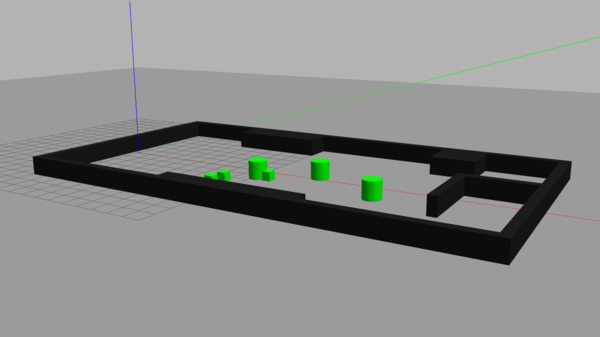

[日本語](/turtlebot3/documentation/README_tb3_big_wheel_jp.md) | [English](/turtlebot3/documentation/README_tb3_big_wheel_en.md)

# TurtleBot3 Friends: Big Wheel


## Navigation Demo in Real-World Environment

| Real-World | RViz |
|:---:|:---:|
|  |  | 

| Real-World | RViz |
|:---:|:---:|
|  |  |


| Real-World | RViz |
|:---:|:---:|
|  |  |

## Navigation Demo in Gazebo Environment

| Gazebo + RViz | 
|:---:|
|  |

## Setup Manual

### 1. Environment Setup
  A few configurations from TurtleBot3 are required to use and test the new Big Wheel model from the TurtleBot3 Friends family. To do so, please follow the official TurtleBot3 e-Manual 「[Quick Start Guide](https://emanual.robotis.com/docs/en/platform/turtlebot3/quick-start/)」. However, take note of the following changes that are pointed out.
  
  - About [1.1. PC Setup](https://emanual.robotis.com/docs/en/platform/turtlebot3/quick-start/#pc-setup)
  The Big Wheel model uses either Raspberry Pi 4B or NUC11 as the SBC. Right now, Big Wheel is only supported by ROS Noetic. Please select the 「Noetic」 branch from the 「[Quick Start Guide](https://emanual.robotis.com/docs/en/platform/turtlebot3/quick-start/)」 and follow the instructions.


  - Changes in [1.1.4. Install TurtleBot3 Packages](https://emanual.robotis.com/docs/en/platform/turtlebot3/quick-start/#install-turtlebot3-packages)

  Once ROS Noetic is installed, we will install some required ROS packages from the ROBOTIS Japan official GitHub repository. Please enter the following commands into the terminal.
  ```bash
  $ sudo apt remove ros-noetic-dynamixel-sdk
  $ sudo apt remove ros-noetic-turtlebot3-msgs
  $ sudo apt remove ros-noetic-turtlebot3
  $ mkdir -p ~/catkin_ws/src
  $ cd ~/catkin_ws/src/
  $ git clone -b noetic-devel https://github.com/ROBOTIS-GIT/DynamixelSDK.git
  $ git clone -b noetic-devel https://github.com/ROBOTIS-GIT/turtlebot3_msgs.git
  $ git clone -b noetic-jp-devel https://github.com/ROBOTIS-JAPAN-GIT/turtlebot3_jp_custom
  $ cd ~/catkin_ws && catkin_make
  $ echo "source ~/catkin_ws/devel/setup.bash" >> ~/.bashrc
  ```
  - About [3.2. SBC Setup](https://emanual.robotis.com/docs/en/platform/turtlebot3/sbc_setup/#sbc-setup)

  In the new Big Wheel model, the NUC11 is used as the main processing computer, instead of the Raspberry Pi 4B that is being used in the `Burger` or `Waffle Pi` models. We will omit the usual SBC setup. Please follow the next steps in your NUC.

  > **Note**
  > In case you still want to use Raspberry Pi 4B, please follow the steps from the TurtleBot3 e-Manual.

  1. Install Ubuntu 20.04.

  2. Install ROS Noetic.

  3. Install the TurtleBot3 required packages as it follows

  ```bash
  $ sudo apt remove ros-noetic-dynamixel-sdk
  $ sudo apt remove ros-noetic-turtlebot3-msgs
  $ sudo apt remove ros-noetic-turtlebot3
  $ mkdir -p ~/catkin_ws/src
  $ cd ~/catkin_ws/src/
  $ git clone -b noetic-devel https://github.com/ROBOTIS-GIT/DynamixelSDK.git
  $ git clone -b noetic-devel https://github.com/ROBOTIS-GIT/turtlebot3_msgs.git
  $ git clone -b noetic-jp-devel https://github.com/ROBOTIS-JAPAN-GIT/turtlebot3_jp_custom
  $ cd ~/catkin_ws && catkin_make
  $ echo "source ~/catkin_ws/devel/setup.bash" >> ~/.bashrc
  ```

  - Changes in [3.3. OpenCR Setup](https://emanual.robotis.com/docs/en/platform/turtlebot3/opencr_setup)

  #### The setup for the OpenCR is done through the NUC.

  1. Connect the [OpenCR](https://emanual.robotis.com/docs/en/parts/controller/opencr10/) to the NUC through a USB Micro-B cable.

  2. Skip the installation of arm Debian packages (in NUC are not required).

  3. Select ```big_wheel_noetic``` as the `OPENCR_MODEL`.
  ```bash
  $ export OPENCR_PORT=/dev/ttyACM0us
  $ export OPENCR_MODEL=big_wheel_noetic
  $ rm -rf ./opencr_update.tar.bz2
  ```

  4. Download the firmware and uncompress it.
  ```bash
  $ wget https://github.com/ROBOTIS-JAPAN-GIT/OpenCR_jp_custom/releases/download/v1.0.0/opencr_update_jp_custom.tar.bz2
  $ tar -xvf opencr_update_jp_custom.tar.bz2 
  ```

  5. Burn the firmware into the OpenCR.
  ```bash
  $ cd ./opencr_update
  $ ./update.sh $OPENCR_PORT $OPENCR_MODEL.opencr
  ```

  6. If the firmware for the TurtleBot3 Big Wheel has been successfully burnt into the OpenCR, the following message will appear.
  


### 2. Network Environment
In standard TurtleBot3 models, Raspberry Pi has been used as the `master PC` for distributed processing. In the case of the new Big Wheel model, the NUC is set up as the `master PC`. To connect to it, we will use ssh through a remote PC, and visualize the NUC-processed topics in RViz. Please follow the next steps.

> **Note**
> In the case you want to use Raspberry Pi 4B, please follow those steps from the TurtleBot3 e-Manual.

- **In the NUC (master PC)**
1. Check the IP address the NUC is connected to.

```bash
$ ifconfig
```

Inside the 「wlp2s0」>「inet addr」, you will find an IP similar to `192.168.X.XXX`. Please, take note of it.
> **Note**
> The 「X」 from the ip `192.168.X.XXX` will change depending on your network.
2. Write the ROS IP inside your 「~/.bashrc」 file.

```bash
$ nano ~/.bashrc
```

Move until the last line of the document and write down the following lines. (Do not forget to change the values of 「X」 depending on your IP)

```bash
export ROS_MASTER_URI=http://192.168.X.XXX:11311
export ROS_HOSTNAME=192.168.X.XXX
```

3. Once it has been added to the file, press `Ctrl+S` to save, and then `Ctrl+X` to go back.

4. Lastly, apply the changes of ROS IP and take them into effect.

```bash
$ source ~/.bashrc
```

- **In the Remote PC**

1. Do not forget the IP address of your NUC. (192.168.X.XXX)
1. Check the IP address of your `remote PC` using the `ifconfig` command and take note of it. (192.168.X.YYY)
1. Write the ROS IP inside your 「~/.bashrc」 file.

```bash
$ nano ~/.bashrc
```

Move until the last line of the document and write down the following lines. (Do not forget to change the 「X」 and the 「Y」 depending on your IP)。

```bash
export ROS_MASTER_URI=http://192.168.X.XXX:11311
export ROS_HOSTNAME=192.168.X.YYY
```

4. Once it has been added to the file, press `Ctrl+S` to save, and then, `Ctrl+X` to go back.

5. Lastly, apply the changes of ROS IP and take them into effect.

```bash
$ source ~/.bashrc
```

### 3. Additional Packages Setup
In the new TurtleBot3 Big Wheel model, 「Realsense D435」 is used as the defaullt camera and 「LDS-series」 as the default LiDAR sensor. Here, we will explain the setup process.

> **Warning**
> The following steps are conducted in the `remote PC`.

1. **Camera Setup**

First of all, please install the required packages.
- ROS Wrapper for Intel® RealSense™ Devices (Based on official website)

```bash
$ sudo apt-get install ros-$ROS_DISTRO-realsense2-camera
$ cd ~/catkin_ws/src
$ git clone https://github.com/ROBOTIS-JAPAN-GIT/realsense-ros_jp_custom
$ cd ~/catkin_ws
$ catkin_make
```

> **Note**
> If you want to know more in detail about the [realsense-ros](https://github.com/IntelRealSense/realsense-ros), please refer to the official GitHub repository.

Now, to use the Realsense D435 in the Gazebo simulation as well, download the next repository.

```bash
$ cd ~/catkin_ws/src
$ git clone https://github.com/pal-robotics/realsense_gazebo_plugin
$ cd ~/catkin_ws
$ catkin_make
```


1. **LiDAR Setup**

In the case of the standard TurtleBot3 Big Wheel, we use the same sensor provided in the original TurtleBot3. You can decide to use either the LDS-01 or the LDS-02. Please refer to the TurtleBot3 e-Manual to complete the setup.


## Simulation Environment (Gazebo)
TurtleBot3 Big Wheel comes with Gazebo support, a simulator that takes into account the physics of its virtual environment. By just downloading the following packages, you will be able to use it with no problems.

```bash
$ cd ~/catkin_ws/src/
$ git clone -b noetic-jp-devel https://github.com/ROBOTIS-JAPAN-GIT/turtlebot3_simulations_jp_custom
$ git clone https://github.com/robotics-upo/lightsfm
$ cd lightsfm
$ make
$ sudo make install
$ cd ~/catkin_ws && catkin_make
```

## Let's move it!

### Real Robot
Congratulations! You have set up your development environment. Now, let's move the TurtleBot3 Big Wheel. To do so, please follow the next steps.

> **Note**
> When connecting to the NUC through ssh, do not forget to use the NUC IP address (192.168.X.XXX).
0. Select the TurtleBot3 model.
```bash 
$ export TURTLEBOT3_MODEL=big_wheel
$ export TURTLEBOT3_PLAT=false
```
> **Note**
> Every time you open a new terminal, it is required to select the TurtleBot3 model. Apart from `big_wheel`, you can also try other models such as `burger`, `waffle_pi`, or `pizza`.
1. In the **NUC**, run roscore.
```bash
$ roscore
```
2. In the **NUC**, launch the Turtlebot3 Big Wheel.
```bash
$ roslaunch turtlebot3_bringup turtlebot3_robot.launch
```
3. If required, in the **remote PC**, launch the TeleOperation.
```bash
$ roslaunch turtlebot3_teleop turtlebot3_teleop_key.launch
```

- **SLAM (mapping) + Navigation**

To use these packages, please refer to the official e-Manual 「[SLAM](https://emanual.robotis.com/docs/en/platform/turtlebot3/slam/)」 and 「[Navigation](https://emanual.robotis.com/docs/en/platform/turtlebot3/navigation/)」. The bringup steps are the same as previous models.


### Simulation
In other to use the Gazebo simulation environment, please refer to the official e-Manual「[1.1.2. Launch Simulation World](https://emanual.robotis.com/docs/en/platform/turtlebot3/simulation/#launch-simulation-world)」. The bringup steps are the same as previous models.

```bash 
$ export TURTLEBOT3_MODEL=big_wheel
$ export TURTLEBOT3_PLAT=false
$ roslaunch turtlebot3_gazebo turtlebot3_empty_world.launch
```

> **Note**
> Apart from `empty_world`, you can also try different environments such as `house`, `simulation`, or `stage_1`. Moreover, as ROBOTIS Japan, we have prepared a few new environments. Right now, we have `turtlebot3_jp_world_empty`, `turtlebot3_jp_world_static`, `turtlebot3_jp_world_dynamic`, `turtlebot3_jp_world_corridor_pedestrian` 4 different worlds ready to use.


| World Name | Image |
|:---:|:---:|
| turtlebot3_jp_world_static |  | 
| turtlebot3_jp_world_dynamic |  |
| turtlebot3_jp_world_corridor_pedestrian |  |
| turtlebot3_jp_world_corridor_pedestrian (rgbd) |  |

## Hardware Related
### Bill Of Materials (BOM)
| Item | Reference no. | Quantity | Link |
|---|---|---|---|
| TurtleBot3 Waffle Pi | --- | 1 | [here](https://e-shop.robotis.co.jp/product.php?id=351) |
| NUC 11 Pro Kit NUC11TNHv7 | BNUC11TNHV70000 | 1 | [here](https://www.ark-pc.co.jp/i/31400996/) |
| Realsense d435 | --- | 1 | [here](https://www.intelrealsense.com/depth-camera-d435/) |
| Wheel (5inch) | --- | 2 | [here]() |
| --- | --- | --- | [here]() |


### 3D Model Reference
If you want to know more in detail about the 3D model parts, please have a look at the  [Turtlebot3 Friends: Big Wheel](https://cad.onshape.com/documents/7daf195495224735934e7007/w/169d3bbd6522bfb5c32193c2/e/39cd43d7a31a1c83661df9da?renderMode=0&uiState=63156a1b6310686ce43b53e0) OnShape document.


### Model Characteristics
| Items | Pizza | Big Wheel |
|---|---|---|
| Maximum translational velocity | 0.35 m/s | 0.50 m/s |
| Maximum rotational velocity | 1.49 rad/s | 3.41 rad/s |
| Maximum payload | ? | 30kg |
| Size (L x W x H) | 434.94mm x 489.10mm x 261.54mm | 281mm x 306mm x 170.30mm |
| Weight |  |  |
| Threshold of climbing |  |  |
| Expected operating time |  |  |
| Expected charging time |  |  |
| Computer | NUC10i7FNHN | Raspberry Pi |
| MCP |  Intel® Core™ i7-10710U Processor (12M Cache, up to 4.70 GHz)  | 32-bit ARM Cortex®-M7 with FPU (216 MHz, 462 DMIPS) |
| Remote Controller | - | - |
| Actuator | XM540-W150 | XM430-W210 |
| LiDAR | SICK TiM571 | 360 Laser Distance Sensor LDS-01 or LDS-02 |
| Camera | Realsense D435 | Realsense D435 |
| IMU | GyroscSeveral programmable beep sequence scope 3 Axis | Gyroscope 3 Axis |
|     | Accelerometer 3 Axis | Accelerometer 3 Axis |
| Power connectors |  | 3.3V / 800mA, 5V / 4A, 12V / 1A |
| Expansion pins |  | GPIO 18 pins, Arduino 32 pins |
| Peripheral |  | UART x3, CAN x1, SPI x1, I2C x1, ADC x5, 5pin OLLO x4 |
| DYNAMIXEL ports | RS485 x 3, TTL x 3 | RS485 x 3, TTL x 3 |
| Audio | Several programmable beep sequences | Several programmable beep sequences |
| Programmable LEDs | User LED x 4 | User LED x 4 |
| Status LEDs | Board status LED x 1, Arduino LED x 1, Power LED x 1 | Board status LED x 1, Arduino LED x 1, Power LED x 1 |
| Buttons and Switches | Push buttons x 2, Reset button x 1, Dip switch x 2 | Push buttons x 2, Reset button x 1, Dip switch x 2 |
| Battery | Makita BL1490 14.4V 9.0Ah | Lithium polymer 11.1V 1800mAh / 19.98Wh 5C |
| PC connection | USB | USB |
| Firmware upgrade | via USB, via JTAG | via USB, via JTAG |
| Power adapter (SMPS) | Input : 100-240V, AC 50/60Hz, 1.5A @max, Output : 12V DC, 5A | Input : 100-240V, AC 50/60Hz, 1.5A @max, Output : 12V DC, 5A |


## ROBOTIS e-Manual for TurtleBot3
- [ROBOTIS e-Manual for TurtleBot3](http://turtlebot3.robotis.com/)

## Open Source related to TurtleBot3
- [turtlebot3_jp_custom](https://github.com/ROBOTIS-JAPAN-GIT/turtlebot3_jp_custom)
- [turtlebot3_msgs](https://github.com/ROBOTIS-GIT/turtlebot3_msgs)
- [turtlebot3_simulations_jp_custom](https://github.com/ROBOTIS-JAPAN-GIT/turtlebot3_simulations_jp_custom)
- [dynamixel_sdk](https://github.com/ROBOTIS-GIT/DynamixelSDK)
- [OpenCR-Hardware](https://github.com/ROBOTIS-GIT/OpenCR-Hardware)
- [OpenCR](https://github.com/ROBOTIS-GIT/OpenCR)
- [realsense-ros_jp_custom](https://github.com/ROBOTIS-JAPAN-GIT/realsense-ros_jp_custom)
- [realsense_gazebo_plugin](https://github.com/pal-robotics/realsense_gazebo_plugin)
- [lightsfm](https://github.com/robotics-upo/lightsfm)

## Documents and Videos related to TurtleBot3
- [ROBOTIS e-Manual for TurtleBot3](http://turtlebot3.robotis.com/)
- [ROBOTIS e-Manual for Dynamixel SDK](http://emanual.robotis.com/docs/en/software/dynamixel/dynamixel_sdk/overview/)
- [Website for TurtleBot Series](http://www.turtlebot.com/)
- [e-Book for TurtleBot3](https://community.robotsource.org/t/download-the-ros-robot-programming-book-for-free/51/)
- [Videos for TurtleBot3](https://www.youtube.com/playlist?list=PLRG6WP3c31_XI3wlvHlx2Mp8BYqgqDURU)
